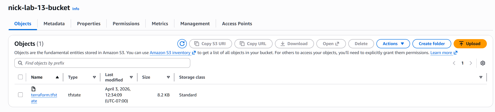
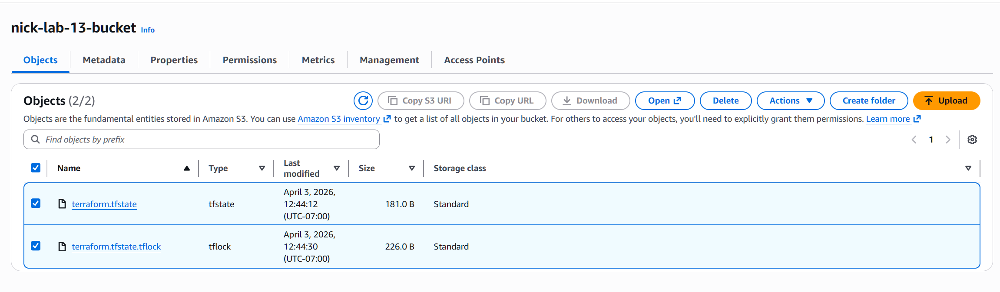

### Nick Cao A01429602
### Luis G. Morin A01433302

---
#### When is the state file created?
The state file is created when `terraform apply` finishes creating our infrastructure.

---
#### When is the lock file present?
The lock file is present while Terraform is running an operation that can change state file.

---
#### Is the lock file always in the bucket after it is created?
No, the lock file is deleted when the command (that changes state file) is finished running or canceled.

---
#### Screenshots
State file

State and lock file
